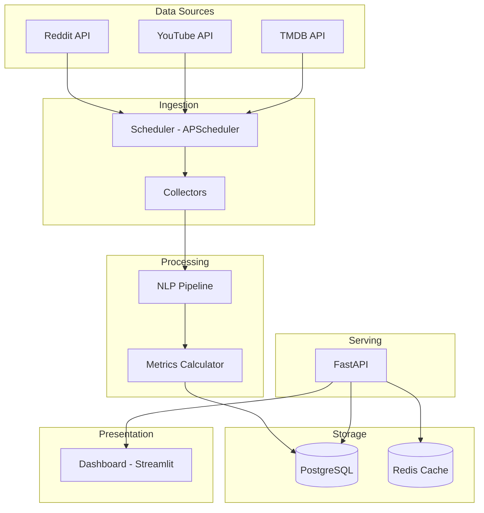

# Social Attention Monitor (SAM) - Implementation Plan

## Executive Summary

A near-real-time data pipeline that monitors social engagement and public sentiment around newly released movies and TV series.

---

## Architecture



---

## Key Metrics

### Attention Index
```python
AI = z(mentions) * 0.25 + z(velocity) * 0.30 + z(unique_users) * 0.25 + z(sentiment) * 0.20
```

### Hype Acceleration
```python
HA = d²/dt²(mentions)  # Second derivative - indicates building or declining hype
```

---

## Technology Stack

| Layer | Technology |
|-------|------------|
| **Language** | Python 3.11+ |
| **API Framework** | FastAPI |
| **Dashboard** | Streamlit |
| **Database** | PostgreSQL |
| **Cache** | Redis |
| **Scheduler** | APScheduler |
| **ORM** | SQLAlchemy 2.0 |
| **NLP** | VADER Sentiment |

---

## Target Subreddits

| Subreddit | Focus |
|-----------|-------|
| `r/movies` | General movie discussion |
| `r/television` | General TV discussion |
| `r/netflix` | Netflix releases |
| `r/DisneyPlus` | Disney+ releases |
| `r/amazonprime` | Prime Video releases |
| `r/appletv` | Apple TV+ releases |

---

## API Keys Required

| Service | URL |
|---------|-----|
| Reddit | https://www.reddit.com/prefs/apps |
| YouTube | https://console.cloud.google.com |
| TMDB | https://www.themoviedb.org/settings/api |

> **Note:** Demo mode works without API keys using mock data.

---

## Phased Timeline

| Phase | Duration | Focus |
|-------|----------|-------|
| 1 | Week 1-2 | Foundation (collectors, models, config) ✅ |
| 2 | Week 3-4 | Core Pipeline (scheduling, storage) |
| 3 | Week 5-6 | API & Dashboard |
| 4 | Week 7-8 | Advanced Features (alerts, WebSocket) |
| 5 | Week 9-10 | Production Readiness (Docker, tests) |
